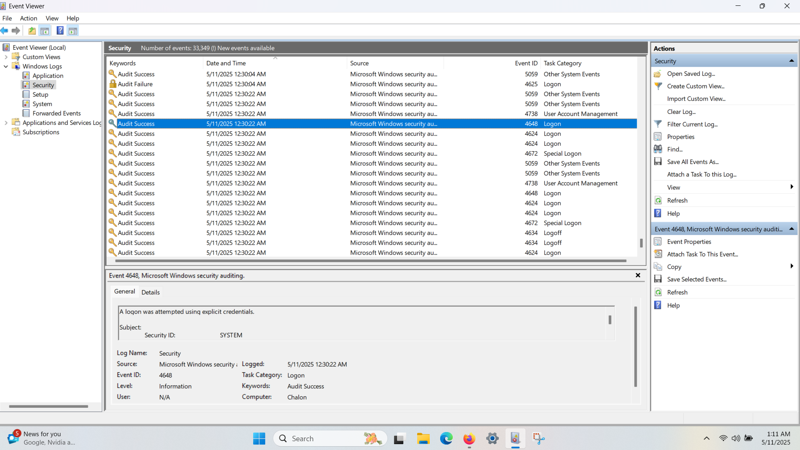

# Windows Event Log Analysis
## Description
This project focuses on analyzing Windows Event Logs, specifically for failed login attempts (Event ID 4625). It includes an analysis of multiple Event IDs and the tools used to collect and interpret them.
## Tools Used
- Event Viewer (built-in Windows tool)
- Windows Security Logs
## Process
1. Open Event Viewer on Windows.
2. Filter and locate Event ID 4625 (Failed Logon).
3. Screenshot and document other relevant Event IDs (e.g., 4624, 4738).
4. Use PowerShell commands to extract logs if needed.
## Event IDs Analyzed
- **4625**: Failed Logon Attempt
  - This event is logged when a user tries to log in with incorrect credentials.
- **4624**: Successful Logon
  - Logs when a user successfully logs in.
- **4738**: A user account was changed
  - Triggered when there is a change in user account properties.
- **4648**: A logon was attempted using explicit credentials
  - This event is logged when a logon is attempted with alternative credentials.
### Screenshots
- 
- 
- 
- 
- 
- 
- 
- 
- 
### Findings
- **Event ID 4625**: Multiple failed logon attempts triggered this alert. Indicates incorrect password usage.  
- **Event ID 5059**: Application pool failure related to IIS (can be ignored in a personal device setting).  
- **Event ID 4738**: A user account was changed — this could relate to password or attribute changes.  
- **Event ID 4648**: A logon was attempted using explicit credentials — may appear during failed logins.  
- **Event ID 4624**: Successful logons — confirms that authentication eventually succeeded.  
- **Event ID 4672**: Special privileges assigned to new logon — indicates admin-level access was granted.  
- **Event ID 4634**: Logoff event — shows when a session ends.  
- **Event ID 5379**: Credential manager credentials were read — worth monitoring for suspicious behavior.  
- **Event ID 4798**: User’s local group membership was enumerated — may happen during account checks.
## Conclusion
- In this project, we analyzed multiple Windows Event Log IDs to identify potential security risks and system activities. The key findings pointed to failed login attempts (Event ID 4625) and successful logons (Event ID 4624), which are crucial for monitoring unauthorized access attempts. Additionally, certain events like **Event ID 5059** and **Event ID 5379** highlight issues with applications and credential management, which are important for security monitoring.
## Future Work
Further analysis could involve automating the detection of suspicious patterns across multiple event IDs using scripts or a SIEM (Security Information and Event Management) tool. Real-time monitoring could help improve the speed of response to security incidents.
## References
- [Microsoft Event ID documentation](https://docs.microsoft.com/en-us/windows/security/threat-protection/auditing/event-4625)
- [PowerShell command reference for event log filtering](https://docs.microsoft.com/en-us/powershell/)
- [Windows Event Viewer guide](https://docs.microsoft.com/en-us/windows/security/threat-protection/auditing/event-4624)
## Acknowledgments
- Special thanks to the open-source community for providing resources and documentation.
- Thanks to my colleagues for the helpful feedback.
- This project marks my first experience with GitHub, and I am proud to have completed it as part of my learning journey.
